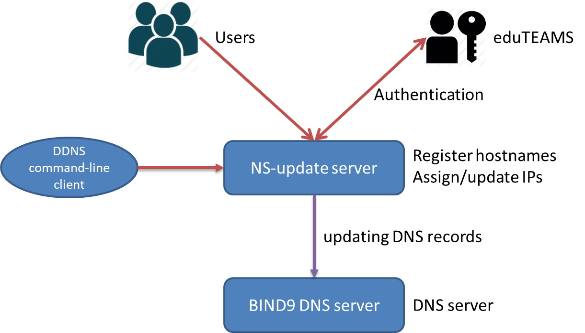

Service design and implementation
=================================

The architecture of the eduDNS service is described in the scheme below. The main component of
the service will be an NS-update server which consists of a GUI front-end, a REST API and a
backend engine for the Dynamic DNS service. Users will log in to GUI front-end using
eduGAIN/eduTEAMS account and register hostnames in supported domains (by default edudns.eu).
After obtaining the hostnames, users will be able to assign/update IP addresses of VMs/servers
to the hostnames, then access the VMs/services via the registered hostnames.

